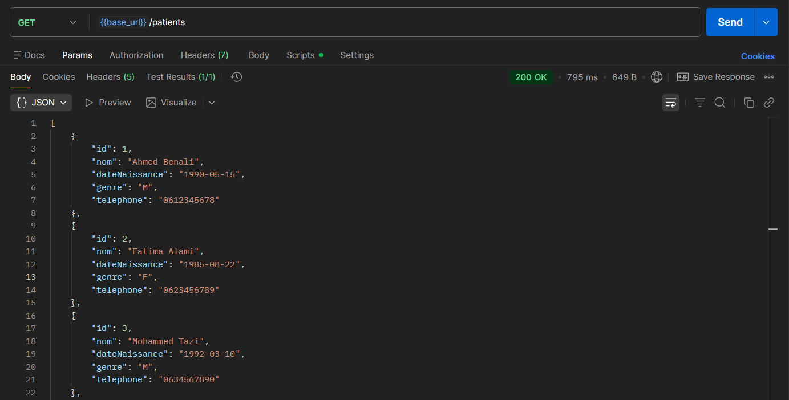
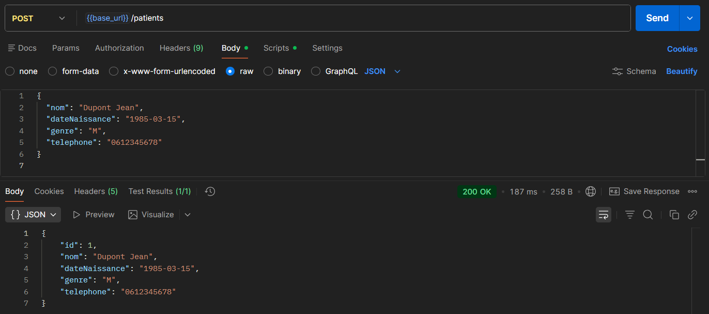
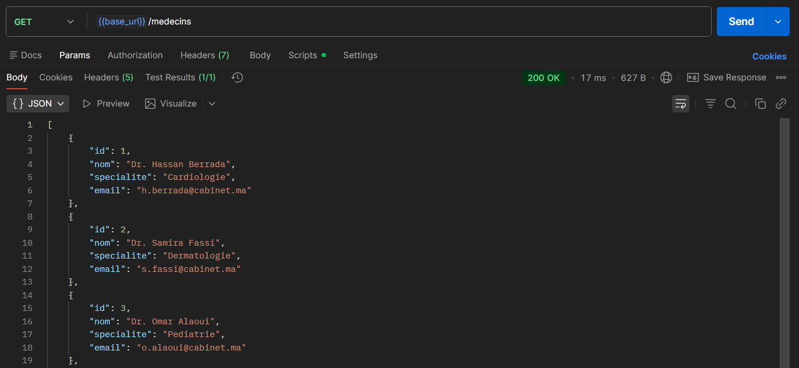
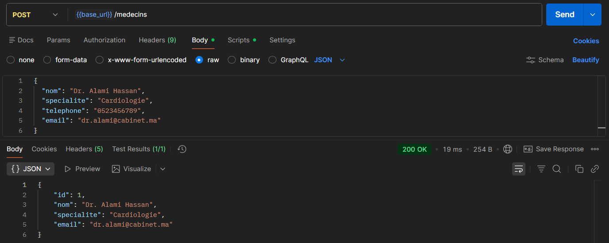
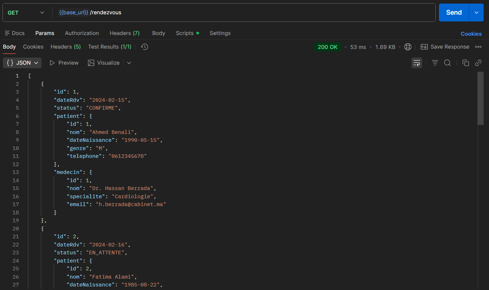
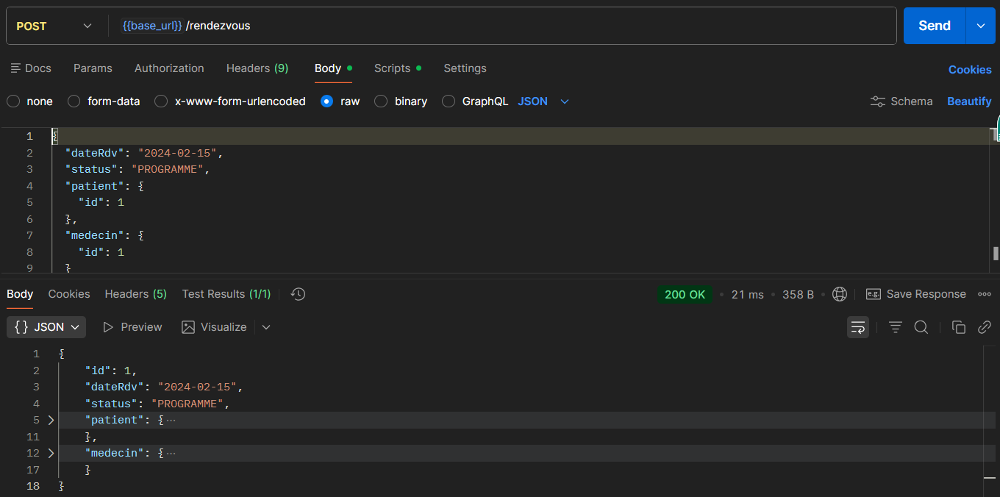
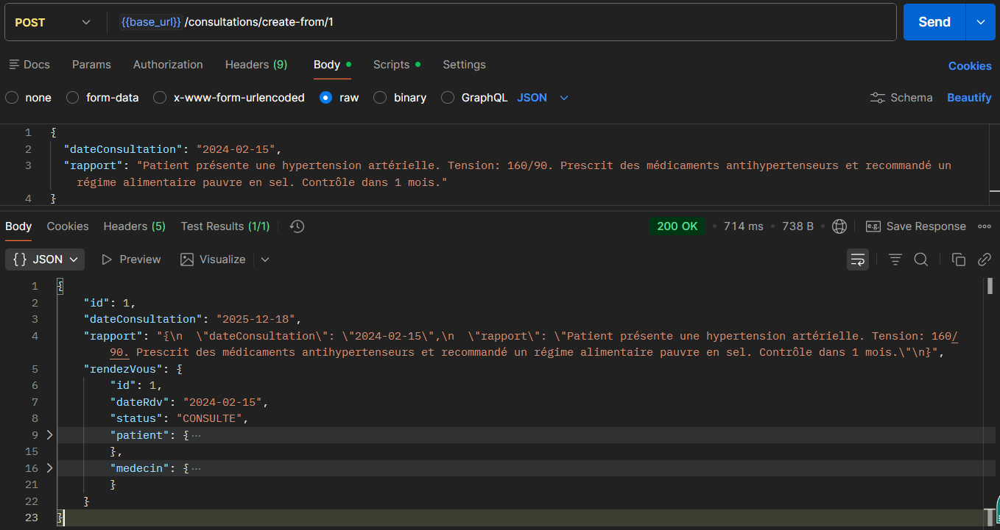

# Cabinet Médical - TP1 Application Monolithique

**Faculté des Sciences de Rabat**  
**Master IPS — Module : Systèmes Distribués Basés sur les Microservices**  
**TP1 — Application Monolithique (Cas : Cabinet Médical)**

## 📋 Description du Projet

Ce projet implémente une application monolithique Spring Boot pour la gestion d'un cabinet médical. Il s'agit de la première phase d'un projet évolutif qui sera découpé en microservices dans les TPs suivants.

## 🏗️ Architecture

L'application suit une architecture en couches :
- **Web Layer** (`web`) : Contrôleurs REST
- **Service Layer** (`service`) : Logique métier
- **Repository Layer** (`repository`) : Accès aux données
- **Model Layer** (`model`) : Entités métier

## 🚀 Technologies Utilisées

- **Java 17+**
- **Spring Boot 3.x**
- **Spring Web**
- **Spring Data JPA**
- **Base de données H2 (en mémoire)**
- **Maven**
- **Lombok**

## 🗃️ Modèle de Données

### Entités
- **Patient** : `id`, `nom`, `dateNaissance`, `genre`, `telephone`
- **Medecin** : `id`, `nom`, `specialite`, `email`
- **RendezVous** : `id`, `dateRdv`, `status`, `patient`, `medecin`
- **Consultation** : `id`, `dateConsultation`, `rapport`, `rendezVous`

## 🛠️ Installation et Démarrage

1. **Cloner le repository**
   ```bash
   git clone <repository-url>
   cd cabinetMedicalTp1
   ```

2. **Compiler et démarrer l'application**
   ```bash
   mvn clean install
   mvn spring-boot:run
   ```

3. **Accéder à l'application**
   - API REST : `http://localhost:8080`
   - Console H2 : `http://localhost:8080/h2-console`
     - JDBC URL : `jdbc:h2:mem:cabinetMedicalTp1DB`
     - Username : `sa`
     - Password : (laisser vide)

## 📡 Endpoints REST

### 👥 Gestion des Patients

| Méthode | Endpoint | Description |
|---------|----------|-------------|
| `GET` | `/api/v1/patients` | Lister tous les patients |
| `POST` | `/api/v1/patients` | Créer un nouveau patient |

**Exemple de requête POST Patient :**
```json
{
  "nom": "Ahmed Benali",
  "dateNaissance": "1990-05-15",
  "genre": "M",
  "telephone": "0612345678"
}
```

### 👨‍⚕️ Gestion des Médecins

| Méthode | Endpoint | Description |
|---------|----------|-------------|
| `GET` | `/api/v1/medecins` | Lister tous les médecins |
| `POST` | `/api/v1/medecins` | Créer un nouveau médecin |

**Exemple de requête POST Médecin :**
```json
{
  "nom": "Dr. Hassan Berrada",
  "specialite": "Cardiologie",
  "email": "h.berrada@cabinet.ma"
}
```

### 📅 Gestion des Rendez-vous

| Méthode | Endpoint | Description |
|---------|----------|-------------|
| `GET` | `/api/v1/rendezvous` | Lister tous les rendez-vous |
| `POST` | `/api/v1/rendezvous` | Créer un nouveau rendez-vous |

**Exemple de requête POST Rendez-vous :**
```json
{
  "dateRdv": "2024-02-25",
  "patientId": 1,
  "medecinId": 1
}
```
*Note: Le statut est automatiquement défini à "EN_ATTENTE" lors de la création.*

### 🩺 Gestion des Consultations

| Méthode | Endpoint | Description |
|---------|----------|-------------|
| `POST` | `/api/v1/consultations/create-from/{rdvId}` | Créer une consultation à partir d'un rendez-vous |

**Exemple de requête POST Consultation :**
```http
POST /api/v1/consultations/create-from/1
Content-Type: application/json

"Consultation de routine. Patient en bonne santé générale. Pression artérielle normale."
```

## 🧪 Tests et Captures d'Écran

### GET - Liste des Patients


### POST - Création d'un Patient


### GET - Liste des Médecins


### POST - Création d'un Médecin


### GET - Liste des Rendez-vous


### POST - Création d'un Rendez-vous


### POST - Création d'une Consultation


## 🔧 Configuration

**application.properties :**
```properties
# Configuration Base de données H2
spring.datasource.url=jdbc:h2:mem:cabinetMedicalTp1DB
spring.jpa.show-sql=true
spring.jpa.hibernate.ddl-auto=create-drop

# Activer la console web H2
spring.h2.console.enabled=true

# Initialisation des données
spring.sql.init.mode=always
spring.jpa.defer-datasource-initialization=true
```

## 📊 Données de Test

L'application est initialisée avec des données de test :
- **5 patients** avec des profils variés
- **5 médecins** avec différentes spécialités (Cardiologie, Dermatologie, Pédiatrie, Gynécologie, Neurologie)
- **6 rendez-vous** avec différents statuts (CONFIRME, EN_ATTENTE, ANNULE)
- **3 consultations** liées aux rendez-vous confirmés

## 💾 Code SQL d'Initialisation

Le fichier `data.sql` contient les données de test suivantes :

```sql
-- Insert Patients
INSERT INTO patient (nom, date_naissance, genre, telephone) VALUES
                                                                ('Ahmed Benali', '1990-05-15', 'M', '0612345678'),
                                                                ('Fatima Alami', '1985-08-22', 'F', '0623456789'),
                                                                ('Mohammed Tazi', '1992-03-10', 'M', '0634567890'),
                                                                ('Aicha Idrissi', '1988-12-05', 'F', '0645678901'),
                                                                ('Youssef Amrani', '1995-07-18', 'M', '0656789012');

-- Insert Medecins
INSERT INTO medecin (nom, specialite, email) VALUES
                                                 ('Dr. Hassan Berrada', 'Cardiologie', 'h.berrada@cabinet.ma'),
                                                 ('Dr. Samira Fassi', 'Dermatologie', 's.fassi@cabinet.ma'),
                                                 ('Dr. Omar Alaoui', 'Pediatrie', 'o.alaoui@cabinet.ma'),
                                                 ('Dr. Nadia Benjelloun', 'Gynecologie', 'n.benjelloun@cabinet.ma'),
                                                 ('Dr. Karim Sabiri', 'Neurologie', 'k.sabiri@cabinet.ma');

-- Insert RendezVous
INSERT INTO rendez_vous (date_rdv, status, patient_id, medecin_id) VALUES
                                                                       ('2024-02-15', 'CONFIRME', 1, 1),
                                                                       ('2024-02-16', 'EN_ATTENTE', 2, 2),
                                                                       ('2024-02-17', 'CONFIRME', 3, 3),
                                                                       ('2024-02-18', 'ANNULE', 4, 4),
                                                                       ('2024-02-19', 'CONFIRME', 5, 5),
                                                                       ('2024-02-20', 'EN_ATTENTE', 1, 2);

-- Insert Consultations
INSERT INTO consultation (date_consultation, rapport, rendez_vous_id) VALUES
                                                                          ('2024-02-15', 'Examen cardiaque normal. Tension arterielle stable.', 1),
                                                                          ('2024-02-17', 'Consultation pediatrique de routine. Croissance normale.', 3),
                                                                          ('2024-02-19', 'Examen neurologique complet. Reflexes normaux.', 5);
```

## 🎯 Objectifs Réalisés

✅ **Création du projet Spring Boot** avec les bonnes dépendances  
✅ **Architecture en couches** implémentée  
✅ **Modélisation des entités** métier complète  
✅ **Repositories Spring Data JPA** pour toutes les entités  
✅ **Couche service** avec logique métier  
✅ **Contrôleurs REST** exposant toutes les opérations  
✅ **Initialisation des données** de test  
✅ **Tests des endpoints** via client REST  

## 🔄 Évolution Prévue

Ce monolithe est conçu pour être facilement découpé en microservices lors du TP2 :
- Service Patient
- Service Médecin
- Service Rendez-vous
- Service Consultation

## 📝 Informations du Projet

- **Groupe** : `ma.fsr.tp1`
- **Artifact** : `cabinetMedical`
- **Nom** : `cabinetMedicalTp1`
- **Port** : `8080`

